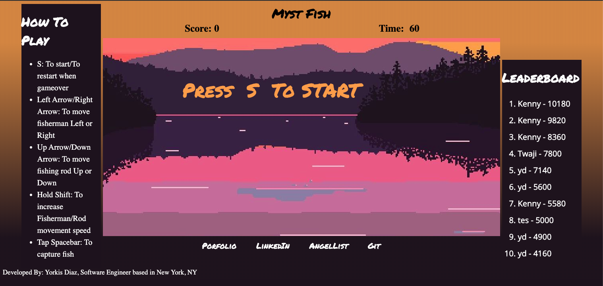

# Myst Fish

Myst Fish is a fishing game that lets users catch fish including the titular Myst Fish. 



Myst Fish hosted at [Myst Fish](https://yorkisdiaz.com/Myst-Fish/)

# Technologies

* JavaScript
* canvasHTML
* CSS3
* SASS
* HTML5
* Webpack
* Firebase


# Key Features

### Countdown Timer

* Game incorporates a countdown timer that tracks the remaining time left to play
* A time Interval begins at the start and DOM manipulaton lets users see the current timer on the screen

### Code sample of Fish.js

```Js
moveFish() {
    if (this.direction === 0) {
      this.x = this.x + this.dx
      if (this.x >= 950) {
        this.direction = 1
        this.fishImage.src = leftFish;
      }
    } else {
      this.x = this.x - this.dx
      if (this.x <= 10) {
        this.direction = 0
        this.fishImage.src = rightFish;
      }
    }
}

detectCollision(rod) {
    let collision = false
    const fishTotalLength = this.x + this.width
    const fishTotalHeight = this.y + this.height
    if (rod.rodX >= this.x &&
        rod.rodX <= fishTotalLength &&
        rod.y >= (this.y + 10) &&
        rod.y <= fishTotalHeight
        ) {
        collision = true
    }
    return collision;
}
```

# Features

* 
