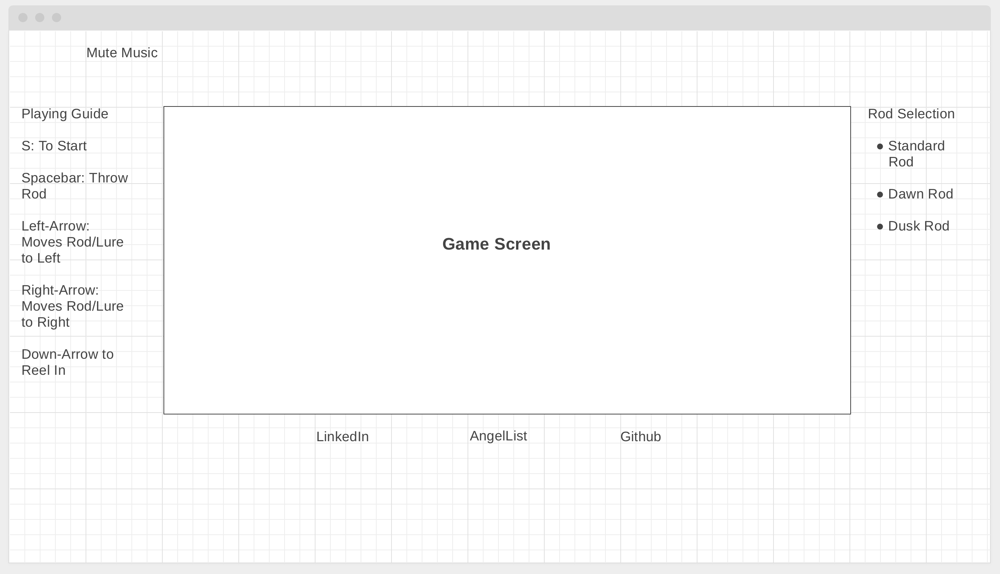

# Myst-Fish

Myst Fish is a fishing game that lets users catch fish until they have caught the titular Myst Fish. 

# MVP / Functionality

1. Game board and selection of fishing rods (Day 1)

2. Fish objects and randomizing algorithm (Day 2)

3. Buttons and User interaction functions (Day 3)

# LOAD PAGE

# Architecture

In addition to the entry file, this project will have the following scripts:

* game.js - this file will contain the game logic necessary to make the game function

* gameview.js - this file will contain the logic for rendering the game canvas and all the view elements. 

* fish.js - this file will contain the fish object and the logic.

* rods - this file will contain the rods logic and the necessary functions

# Implementation Timeline

### Day 1: 
 Setup all necessary modues, including getting webpack up and running  Write a basic entry file and the bare bones of all the necessary scripts.

### Day 2:
 Take the day to learn the necessary APIs and build out the fish objects and algorithm

### Day 3:
 Create the logic that will handle the rendering of the fish, rods and their functionality

 Install the controllers for the user interaction and Styling the gameview

# Technology
* Javascript
* HTML